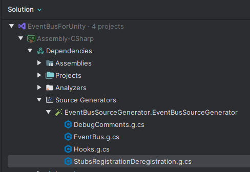

---
sidebar_position: 1
---

# Basic usage

## Quick start

To get started, add something like the following to any class inheriting from `MonoBehaviour`.

```csharp
using Assembly_CSharp.EventBusForUnity; // Note: per assembly an EventBus is generated, so this might have a different prefix than 'Assembly_CSharp'
using EventBusForUnity;
using UnityEngine; 

public class OnHelloWorldEvent
{
    public string Message; 
}

public partial class HelloWorldExample : MonoBehaviour
{
    [Listener]
    private void OnHelloWorld(OnHelloWorldEvent evnt)
    {
        // do whatever you want to do
        Debug.Log(evnt.Message);
    }

    private void Awake()
    {
        // Important! Call this (preferably) once in the entrypoint of your game, the first possible thing (e.g. when loading resources, etc)
        EventBus.Initialize(); 
    }

    void Start()
    {
        EventBus.Send(new OnHelloWorldEvent()
        {
            Message = "Hello World from EventBus for Unity!"
        });
    }
}
```

Re-focus Unity for the source generator to be automatically setup, and press play. You should see a log entry in Unity when running this now.

## How does this work?
First, you call `EventBus.Initialize()` on the entrypoint of your game, the Awake() method of a GameManager or somewhere else.

When you add the `[Listener]` attribute to your method the source generator automatically generates the necessary methods to register and unregister your listener.
This significantly reduces the overhead (and potential memory leaks) when following the EventBus pattern.

You can learn more on how to configure where the (de)registration of your listener methods happens in the next chapters.

### Note on `EventBus.Initialize()`
It's important that you call `EventBus.Initialize()` before you expect calls to go to your listener methods.

If you call `EventBus.Initialize()` inside your `Start()` method where you also have `Listeners` defined, it will not work. `EventBus.Initialize()` needs to be called **before** `Start()`. The order of execution for `Start()` is as follows: the patched `Start()` that registers `Listeners` -> your `Start()` implementation -> `EventBus.Initialize()`. 

Since this must happen before the `Listeners` are registered, a simple solution is to call `EventBus.Initialize()` inside the `Awake()` method.

## EventBus per Assembly
The source generator automatically gets the name of the assembly. 
This is the .csproj name usually, or the name defined in the .asmdef file.

By default, in Unity the assembly name is `Assembly-CSharp` of your code unless you are using Unity's [Assembly feature](https://docs.unity3d.com/6000.0/Documentation/Manual/assembly-definition-files.html).


For instance, if you define a custom assembly using `src.asmdef`, the EventBus will be accessible under the `src.EventBusForUnity` namespace.

If you are not using `.asmdef` files, the prefix will default to what is shown in the initial code snippet.
## Inspecting the source generated files
If you are curious, or are wondering on how the EventBus logic works internally, then you can view the source generated files for your assembly quite easily. Using Rider you can find the generated files via the below screenshot.

