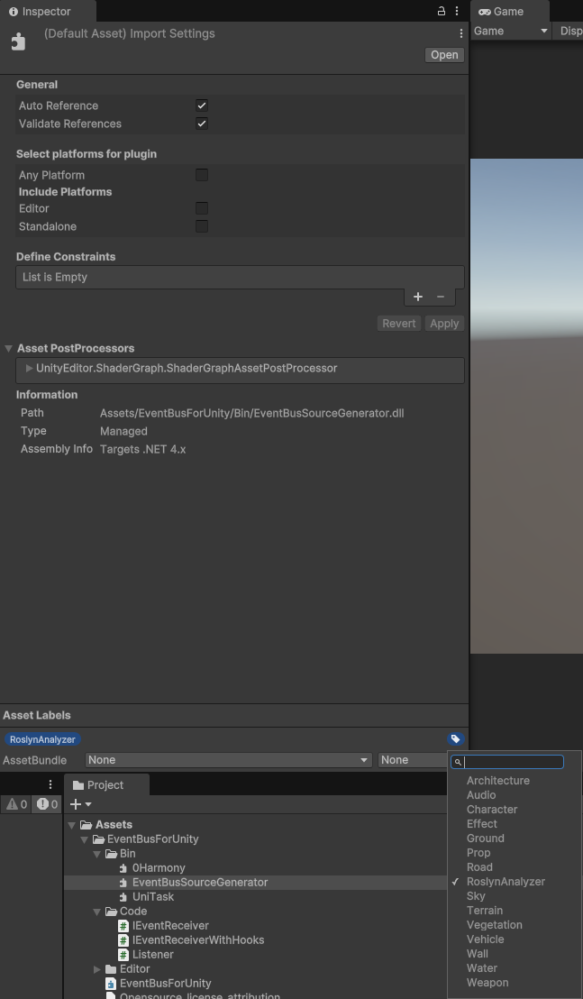

---
sidebar_position: 2
---

# Installation

It's relatively straight forward.

1. Download the unity package from the asset store
2. Open in Unity by double-clicking the `.unitypackage` files and import them in your Unity project
3. You should see a welcome pop-up

You should now be set up to use the library.

## In the case source generation is not working (no EventBus in EventBusForUnity namespace)

You might have an issue with the .meta files not copying the labels correctly. In this case, please add the label 'RoslynAnalyzer' to `EventBusForUnity\Bin\EventBusSourceGenerator.dll`.
This is case-sensitive.

See the below screenshot. You might need to add the `RoslynAnalyzer` label yourself. Remember, it's **case-sensitive**.

For any questions, always feel free to reach out in the discord
